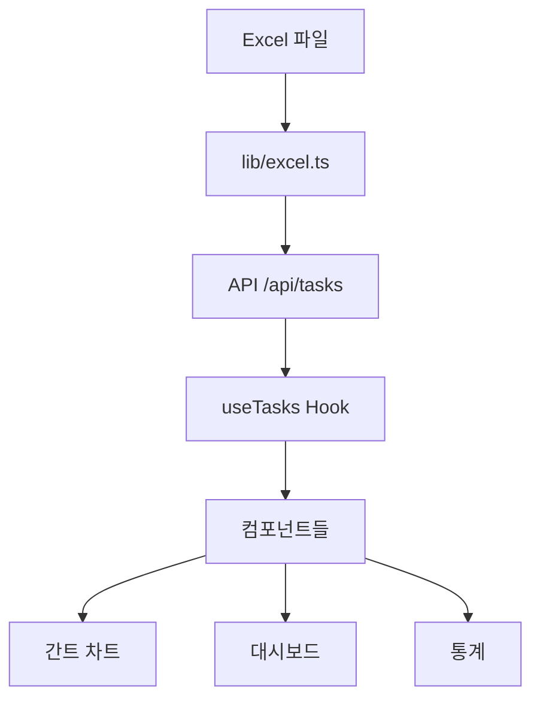

# 🚀 MVNO 프로젝트 관리 시스템

Excel 파일 기반의 간트 차트 프로젝트 관리 시스템입니다.

## ✨ 주요 기능

### 📊 간트 차트 뷰
- **전체 개요 모드**: 그룹별 대표 작업을 요약해서 표시
- **세부 일정 모드**: 선택한 그룹의 작업들을 상세히 표시
- **그룹핑 기능**: 담당자별, 대분류별, 중분류별, 소분류별로 작업 그룹화
- **Custom HTML5 Canvas 간트 차트**: 완전한 커스텀 간트 차트로 모든 요구사항 지원
- **날짜 헤더 고정**: 상단 날짜 축이 스크롤 시에도 고정 표시
- **Action Item 왼쪽 정렬**: 작업명이 깔끔하게 왼쪽 정렬

### 📈 대시보드 기능
- 전체 진행률 및 작업 현황 통계 (완료/진행중/미시작)
- 담당자별 진행 현황 및 평균 진행률
- 위험 작업 및 지연 작업 실시간 알림
- 실시간 Excel 파일 새로고침 기능

### 📄 Excel 파일 연동
- 프로젝트 루트의 `250729_TODO LIST.xlsx` 파일 자동 읽기
- 파일 변경 시 간편한 새로고침 기능 (Excel 새로고침 버튼)
- 엑셀 시리얼 날짜 자동 변환 (Excel 날짜 → JavaScript Date)
- [Excel 파일 형식 가이드](./docs/excel-format.md) 참조

### 🎛️ 유연한 뷰 옵션
- **날짜 단위 선택**: 주별/월별 표시 전환
- **그룹 확장/축소**: 세부 일정 모드에서 그룹별 확장/축소 제어
- **작업 상세 정보**: 개별 작업 클릭 시 상세 정보 모달 표시

## 🎯 사용 대상

### 의사결정자
- **전체 개요 모드**로 프로젝트 전체 진행 상황 파악
- 위험 작업 및 지연 작업 모니터링
- 담당자별 성과 및 진행률 확인
- 대분류별 주요 업무 진행 상황 모니터링

### 실무 담당자
- **세부 일정 모드**로 상세 작업 계획 확인
- 선행 작업 및 의존성 관계 파악
- 개별 작업의 세부 정보 조회 (비용, 기간, 비고 등)
- 담당자별, 카테고리별 작업 필터링

## 🚀 시작하기

### 1. 개발 서버 실행

```bash
npm run dev
# or
yarn dev
# or
pnpm dev
# or
bun dev
```

### 2. 브라우저 접속

[http://localhost:3000](http://localhost:3000)에서 확인

### 3. Excel 파일 준비

- 프로젝트 루트에 `250729_TODO LIST.xlsx` 파일 배치
- [Excel 파일 형식 가이드](./docs/excel-format.md) 참조하여 작성

## 🏗️ 프로젝트 구조

```
mvno-manager/
├── app/                          # Next.js 13+ App Router
│   ├── api/
│   │   ├── tasks/               # 작업 데이터 API
│   │   └── test-excel/          # Excel 파일 테스트 API
│   ├── globals.css              # 글로벌 스타일
│   ├── layout.tsx               # 루트 레이아웃
│   └── page.tsx                 # 메인 페이지
├── components/                   # React 컴포넌트
│   ├── gantt/                   # 간트 차트 관련 컴포넌트
│   │   ├── CustomGanttChart.tsx # 커스텀 HTML5 Canvas 간트 차트 (메인)
│   │   ├── GanttControlPanel.tsx # 간트 차트 제어 패널
│   │   ├── GanttDateHeader.tsx  # 고정 날짜 헤더 컴포넌트
│   │   ├── GanttGroupSelector.tsx # 그룹 선택/확장 컨트롤
│   │   └── GanttTaskDetail.tsx  # 작업 상세 정보 모달
│   ├── GanttChart.tsx           # 메인 간트 차트 컨테이너
│   ├── Header.tsx               # 페이지 헤더
│   ├── Loading.tsx              # 로딩 컴포넌트
│   ├── ResourceStats.tsx        # 담당자별 통계
│   ├── RiskAnalysis.tsx         # 위험 분석
│   └── StatsDashboard.tsx       # 통계 대시보드
├── constants/                    # 상수 정의
│   └── index.ts                 # 뷰 모드, 그룹화 옵션 등
├── docs/                        # 문서
│   └── excel-format.md          # Excel 파일 형식 가이드
├── hooks/                       # React 커스텀 훅
│   ├── useGanttChart.ts         # 간트 차트 상태 관리
│   └── useTasks.ts              # 작업 데이터 관리
├── lib/                         # 라이브러리
│   ├── excel.ts                 # Excel 파일 파싱
│   └── supabase.ts              # Supabase 클라이언트
├── public/                      # 정적 파일
├── styles/                      # 스타일 시트
│   └── components.module.css    # 컴포넌트별 CSS 모듈
├── types/                       # TypeScript 타입 정의
│   ├── task.ts                  # 작업 관련 타입
│   └── database.ts              # 데이터베이스 타입
├── utils/                       # 유틸리티 함수
│   ├── canvasGanttUtils.ts      # Canvas 간트 차트 유틸리티 (설정, 계산)
│   ├── canvasRenderer.ts        # Canvas 렌더링 함수 (그리기 로직)
│   ├── ganttDataProcessor.ts    # 간트 차트 데이터 처리 로직
│   ├── ganttUtils.ts            # 간트 차트 유틸
│   └── taskUtils.ts             # 작업 관련 유틸
├── 250729_TODO LIST.xlsx        # 메인 Excel 파일
├── todo_list_copy.xlsx          # Excel 파일 백업
└── package.json                 # 프로젝트 설정
```

## 📋 Excel 파일 형식

현재 시스템은 `250729_TODO LIST.xlsx` 파일의 `250729_v2` 시트를 읽습니다.

### 파일 구조
- **시트명**: `250729_v2`
- **헤더 위치**: 4번째 행 (Row 3, 0-based index)
- **데이터 시작**: 5번째 행부터 (Row 4부터)

### 컬럼 구조

| 컬럼명 | 설명 | 필수 여부 | 예시 |
|-------|------|----------|------|
| 대분류 | 업무의 대분류 | 필수 | B1_사업자 등록 |
| 중분류 | 업무의 중분류 | 필수 | B1-1_기간통신사업자 |
| 소분류 | 업무의 소분류 | 필수 | B1-1-1_기간통신사업자 제7호 |
| 주관부서(정) | 주담당 부서 | 필수 | 사업전략, 재무, 개발 |
| 주관부서(부) | 부담당 부서 | 선택 | - |
| 담당자(정) | 주담당자 | 필수 | 이규형, 김철호 |
| 담당자(부) | 부담당자 | 선택 | 한천용 |
| 세부업무 | 실제 수행할 업무 | 필수 | 과기부 전파관리소 등록 |
| 완료여부 | 작업 상태 | 필수 | 완료, 진행중, 미완료 |
| 추정 소요 비용 | 예상 비용 | 선택 | 월 4만원, 1억원 예상 |
| 비고 | 추가 메모 | 선택 | 우선순위 높음 |
| 시작일 | Excel 시리얼 날짜 | 필수 | 45820 |
| 종료일 | Excel 시리얼 날짜 | 필수 | 45866 |
| 기간 | 작업 기간 (일) | 자동계산 | 47, 11, 68 |
| 완료율 | 진행률 (0~1) | 필수 | 1 (100%), 0.1 (10%) |

## 🛠 기술 스택

### 프론트엔드
- **Next.js 15**: React 기반 풀스택 프레임워크
- **React 19**: 사용자 인터페이스 라이브러리
- **TypeScript**: 타입 안전성을 위한 정적 타입 언어
- **Tailwind CSS**: 유틸리티 우선 CSS 프레임워크

### 차트 라이브러리

- **Custom HTML5 Canvas**: 완전 커스텀 간트 차트 (현재 사용)
- 날짜 헤더 고정 기능 완벽 지원
- Action Item 왼쪽 정렬 완벽 지원

### 데이터 처리
- **xlsx**: Excel 파일 파싱 라이브러리
- **date-fns**: 날짜 조작 및 포맷팅
- **ExcelJS**: Excel 파일 고급 처리

### 개발 도구
- **PostCSS**: CSS 후처리기
- **ESLint**: 코드 품질 도구
- **Prettier**: 코드 포맷터

## 🔧 주요 기능 설명

### 1. 간트 차트 시스템

#### Custom HTML5 Canvas 간트 차트
현재 시스템의 핵심인 완전 커스텀 간트 차트는 다음 기능을 제공합니다:

- **날짜 헤더 고정**: 스크롤 시에도 상단 날짜 축이 고정 표시
- **Action Item 왼쪽 정렬**: 작업명이 깔끔하게 왼쪽 정렬
- **반응형 디자인**: 화면 크기에 따른 자동 조정
- **마우스 인터랙션**: 클릭, 호버 등 사용자 상호작용 지원

#### 뷰 모드
- **전체 개요**: 그룹별 대표 작업만 표시
- **세부 일정**: 선택한 그룹의 모든 작업 표시

#### 그룹화 옵션
- **담당자별**: 작업 담당자 기준으로 그룹화
- **대분류별**: 업무 대분류 기준으로 그룹화
- **중분류별**: 업무 중분류 기준으로 그룹화
- **소분류별**: 업무 소분류 기준으로 그룹화

### 2. 대시보드 분석

#### 통계 대시보드
- 전체 진행률 (평균 완료율)
- 완료된 작업 수
- 진행 중인 작업 수
- 미시작 작업 수

#### 담당자별 통계
- 담당자별 평균 진행률
- 담당자별 할당된 작업 수
- 담당자별 완료 작업 수
- 진행률 시각화 (프로그레스 바)

#### 위험 분석
- **위험 작업**: 진행률이 낮고 마감일이 임박한 작업
- **지연 작업**: 마감일이 지났거나 진행이 부진한 작업
- 실시간 알림 및 시각적 강조

### 3. Excel 연동 시스템

#### 자동 파일 읽기
- 프로젝트 루트의 Excel 파일 자동 감지
- 여러 파일 경로 시도 (원본, 백업본)
- 파일 접근 불가 시 샘플 데이터 제공

#### 데이터 변환
- Excel 시리얼 날짜 → JavaScript Date 자동 변환
- 한국어 상태값 → 영문 상태값 매핑
- 빈 값 처리 및 기본값 설정
- 데이터 유효성 검증

## 🔄 데이터 흐름



1. **Excel 파일 읽기**: `lib/excel.ts`에서 Excel 파일 파싱
2. **API 엔드포인트**: `/api/tasks`에서 데이터 제공
3. **커스텀 훅**: `useTasks`에서 데이터 상태 관리
4. **컴포넌트 렌더링**: 각 컴포넌트에서 데이터 시각화

## 🎨 UI/UX 특징

### 반응형 디자인
- 모바일, 태블릿, 데스크톱 대응
- 유연한 그리드 레이아웃
- 적응형 차트 크기

### 사용자 경험
- 직관적인 아이콘과 라벨
- 명확한 상태 표시 (완료/진행중/미완료)
- 실시간 데이터 새로고침
- 로딩 상태 표시

### 접근성
- 의미론적 HTML 구조
- 키보드 네비게이션 지원
- 색상 대비 최적화
- 스크린 리더 호환

## 🚨 문제 해결

### Excel 파일 읽기 오류
1. 파일 경로 확인: 프로젝트 루트에 `250729_TODO LIST.xlsx` 존재 확인
2. 파일 권한 확인: 파일이 다른 프로그램에서 열려있지 않은지 확인
3. 시트명 확인: `250729_v2` 시트가 존재하는지 확인
4. 데이터 형식 확인: [Excel 파일 형식 가이드](./docs/excel-format.md) 참조

### 간트 차트 렌더링 문제
1. 브라우저 캐시 클리어
2. 개발 서버 재시작
3. 브라우저 개발자 도구에서 콘솔 오류 확인

### 성능 최적화
1. 대용량 데이터의 경우 페이지네이션 고려
2. 불필요한 리렌더링 방지를 위한 메모이제이션
3. 이미지 및 정적 자원 최적화

## � 향후 계획

### 단기 목표
- [ ] 간트 차트 추가 인터랙션 (드래그 앤 드롭)
- [ ] 작업 의존성 시각화
- [ ] 다크 모드 지원
- [ ] 더 많은 차트 타입 지원

### 중기 목표
- [ ] 실시간 협업 기능
- [ ] 작업 알림 시스템
- [ ] 모바일 앱 지원
- [ ] 다국어 지원

### 장기 목표
- [ ] 클라우드 스토리지 연동
- [ ] AI 기반 프로젝트 분석
- [ ] 고급 리포팅 기능
- [ ] 타사 도구 통합

## 📞 지원

프로젝트 관련 문의사항이나 버그 리포트는 다음을 통해 연락해주세요:

- 이슈 트래커: GitHub Issues
- 이메일: project-support@company.com
- 문서: [Excel 파일 형식 가이드](./docs/excel-format.md)

---

**마지막 업데이트**: 2025년 8월 1일
