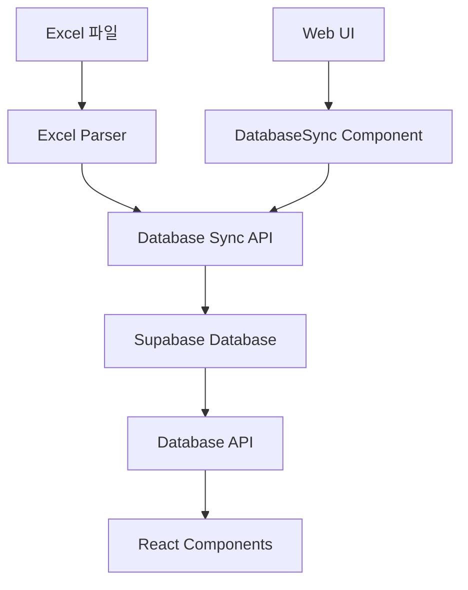

# 📊 데이터베이스 연동 가이드

## 🎯 개요

Excel 파일 기반 시스템에서 Supabase 데이터베이스 연동을 추가했습니다.
이제 Excel 데이터를 데이터베이스에 저장하고 관리할 수 있습니다.

## 🏗️ 구조



## ⚙️ 설정 방법

### 1. Supabase 프로젝트 생성

1. [Supabase](https://supabase.com)에 가입/로그인
2. 새 프로젝트 생성
3. 프로젝트 설정에서 API 키 확인

### 2. 데이터베이스 테이블 생성

Supabase SQL Editor에서 다음 SQL 실행:

```sql
-- supabase/migrations/001_create_tasks_table.sql 파일 내용 실행
```

### 3. 환경 변수 설정

`.env.local` 파일 생성:

```env
NEXT_PUBLIC_SUPABASE_URL=https://your-project.supabase.co
NEXT_PUBLIC_SUPABASE_ANON_KEY=your_anon_key
```

## 🔄 사용 방법

### 1. 데이터베이스 동기화

웹 페이지 상단의 "데이터베이스 동기화" 섹션에서:

1. **상태 확인** 버튼으로 현재 동기화 상태 확인
2. **Excel → DB 동기화** 버튼으로 Excel 데이터를 데이터베이스에 저장

### 2. API 엔드포인트

#### Excel 동기화 API
- `GET /api/sync` - 동기화 상태 확인
- `POST /api/sync` - Excel → Database 동기화 실행

#### 데이터베이스 작업 API
- `GET /api/tasks-db` - 데이터베이스에서 작업 조회 (Excel 폴백 포함)

### 3. React Hooks

```typescript
// Excel 기반 (기존)
const { tasks, loading, error } = useTasks()

// 데이터베이스 기반 (새로 추가)
const { tasks, loading, error, source } = useTasksFromDatabase()
```

## 📁 새로 추가된 파일

```
lib/database/
├── index.ts                 # Database 모듈 export
└── tasks.ts                 # Task CRUD 함수들

app/api/
├── sync/route.ts           # Excel ↔ Database 동기화 API
└── tasks-db/route.ts       # Database 기반 Tasks API

components/
└── DatabaseSync.tsx        # 동기화 UI 컴포넌트

hooks/data/
└── useTasksFromDatabase.ts # Database 기반 커스텀 훅

supabase/migrations/
└── 001_create_tasks_table.sql # 데이터베이스 스키마

types/
└── database.ts             # Database 타입 정의 (업데이트)
```

## 🔧 주요 기능

### 1. 양방향 데이터 흐름

- **Excel → Database**: Excel 파일 데이터를 데이터베이스에 저장
- **Database → UI**: 데이터베이스에서 데이터를 조회하여 화면에 표시

### 2. 자동 폴백

데이터베이스 연결 실패 시 자동으로 Excel 파일로 폴백

### 3. 실시간 동기화 상태

웹 UI에서 Excel과 데이터베이스의 동기화 상태를 실시간으로 확인

### 4. 타입 안전성

TypeScript로 데이터베이스 스키마와 API 타입을 엄격하게 관리

## ⚠️ 주의사항

1. **데이터 덮어쓰기**: 동기화 시 기존 데이터베이스 내용이 모두 삭제됩니다.
2. **환경 변수**: `.env.local` 파일이 없으면 데이터베이스 기능이 작동하지 않습니다.
3. **네트워크**: 인터넷 연결이 필요합니다.

## 🚀 향후 계획

1. **실시간 동기화**: Excel 파일 변경 감지 및 자동 동기화
2. **웹 기반 편집**: 브라우저에서 직접 작업 수정 기능
3. **버전 관리**: 작업 변경 이력 추적
4. **다중 사용자**: 동시 편집 및 충돌 해결
5. **백업/복원**: 자동 백업 및 복원 기능

## 🤝 기여

데이터베이스 관련 기능 개선이나 버그 수정은 언제든 환영합니다!
